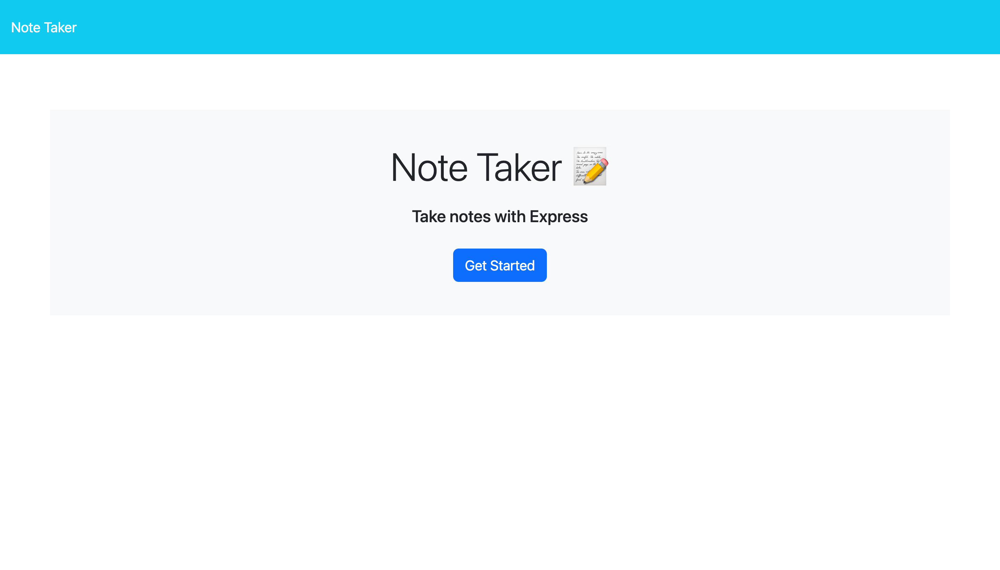
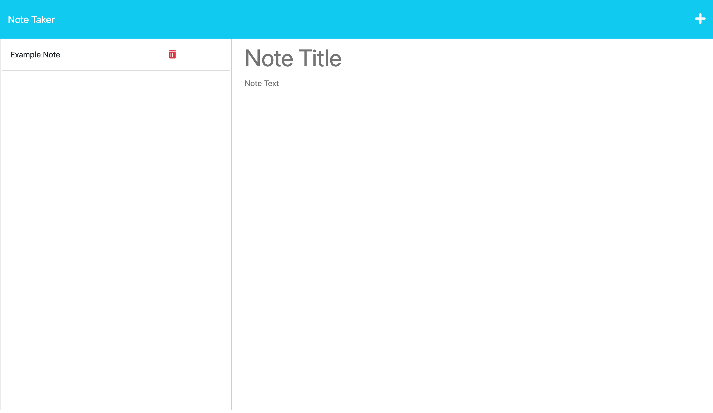

# Note Taker Application
## Description
This application is designed for the user to create notes for themselves and reference them as needed. The home page is simple, only has one link which takes the user to the notes page where they can create, reference, and delete notes. This project utilizes JavaScript, HTML, CSS, and Express.js. Referencing the db.json file that conatins all of the notes data, the server.js file uses GET, POST, and DELET requests to let the user view the notes, create a new note, or delete a note.
## Usage
- The usage of this app is very simple. Click on the Get Started button on the home page to be directed to the notes page of the application. 
- Once there, the user will see a empty Note Title field and an empty Note Text field. The user can then enter in the desired title and desired information in these text areas. 
- To save a note click the save button on the top right of the page, to the left to the + icon.
- That note will then appear in the column on the left side where the user can click on a note title and then see the information for that note.
- To create a new note, click the + icon which will then show an emoty Note Title field and Note Text field for the user to enter a new note.
- If the user desires to remove a note, click the red trash can icon next to the note title in the left side column and that note will be deleted.
### Resources
[Deployed Application](https://note-taker-application0001-86b2db245d15.herokuapp.com/)
[Github Repo](https://github.com/cdgonzo23)

### Example Screenshots

